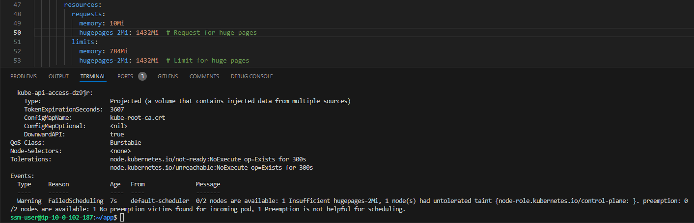

# SPDK - Container app
This repository contains the codebase for a simple SPDK container application. And includes the necessary Terraform scripts for infrastructure setup and scripts for building/deploying the container. The application is configured for deployment using simple docker and K3s setup.

## Problem statement
To create a simple deployment of SPDK container, achieving following objectives:
- Determine the maximum available (free) huge page memory in the system and assign that amount as a limit to k8s resources
- Make sure that the mem-size (e.g. 1G) is passed into the container to be used when launching the process

##  Solution
Following is a detailed explanation of the solution to problem, and steps that were taken to achieve it.

### Directory structure:
The repository is structured in following directories:  
├── docker&nbsp;&nbsp;&nbsp;&nbsp;&nbsp;&nbsp;=> Contains Dockerfile and build content  
├── k8s&nbsp;&nbsp;&nbsp;&nbsp;&nbsp;&nbsp;&nbsp;&nbsp;&nbsp;&nbsp;&nbsp;&nbsp;=> Kubernetes manifests for deploying resources  
├── media&nbsp;&nbsp;&nbsp;&nbsp;&nbsp;&nbsp;&nbsp;=> Directory for images used in documentation  
├── scripts&nbsp;&nbsp;&nbsp;&nbsp;&nbsp;&nbsp;&nbsp;=> Contains shell scripts for Kubernetes deployment and cleaning resources  
└── terraform&nbsp; => Terraform scripts to provision resources on AWS for K3s setup (VPC, ASGs, ECR)  
readme.md  

###   Pre-requisites
Following pre-requisites must be completed/present on system to execute scripts and follow this documentation:
- [AWS CLI](https://docs.aws.amazon.com/cli/latest/userguide/getting-started-install.html) configured with privileged user
- [Terraform](https://developer.hashicorp.com/terraform/install) installed
- [Gossm](https://github.com/gjbae1212/gossm) package (to ssh into K3s/EC2 nodes)

## Instructions
At a high level, following approach will be used, followed by detailed instructions:  
- Cloning repository on local
- Provisioning resources on AWS (3 ASGs: K3s Master, K3s Worker, Admin)
    - Admin node, to be used for docker build and simple docker deployment
    - K3s Master and Worker to be used for Kubernetes deployment
- Deployment and testing for Docker
- Deployment and testing for Kubernetes 

Below are step by step explaning and detailing the deployment:

### 1. Provision resources
- Navigate to the `terraform` directory and initialize Terraform (make sure version greater than `1.0.0` is used):
    ```bash
    cd terraform
    terraform init
    ```

- Inside variables.tf file, update values of required variables. Such as:
  - `region`: AWS region to create resources in
  - `vpc_cidr`: CIDR range of VPC created for AWS resources
  - `enable_public_ip`: Enable or disable Public IPs for EC2 instances, default is set to false
  - K3s master, worker node size etc.

- Create the plan and apply to create resources:
    ```bash
    terraform plan -out plan
    terraform apply plan
    ```

- Following is a high-level architecture of how resources would look like:  


### 2. Test docker build and deployment
After terraform resources are created, we will use them and create container image.
- To build the container image and push it, SSH into `admin` node is recommended.
- Use following command to ssh into `admin` node:
    ```bash
    ~$ gossm start 
    # From the output, choose a target instance (admin node, in this case) and press Enter to ssh into it

    region (us-west-1)
    ? Choose a target in AWS:  [Use arrows to move, type to filter]

    > simplyblock-admin-node        (i-030842ea5cb3303d3)
    simplyblock-master-node       (i-0d6cb0d60a87c6e7d)
    simplyblock-worker-node       (i-021526459efedc713)
    ```
- Copy contents of docker folder to it, or clone GitHub repository on it, to build docker image
- Notice the ENTRYPOINT and CMD Dockerfile instuctions, CMD is used to pass arguments to `entrypoint.sh` script
- Make required changes in `ecr_build.sh`, such as:
    - REGION&nbsp;&nbsp;&nbsp;&nbsp;&nbsp;&nbsp;&nbsp;&nbsp;&nbsp;=> AWS Region of resources
    - REPO_NAME&nbsp;&nbsp;=> Amazon ECR repository name
    - IMAGE_TAG&nbsp;&nbsp;&nbsp;&nbsp;=> Image tag to be used for the container image
- Execute script:
    ```bash
    bash ecr_build.sh
    ```
- Check ECR repository to verify the latest tag push  

- Uncomment last 4 lines of the same `ecr_build.sh` script and rerun it. This will use the same image and run container on `admin` node.
- Execute script:
    ```bash
    bash ecr_build.sh

    ........ // logs of script
    baaed71bc83e42fdd64f80e5895a415e1e4d68cd036ab5802ddf20d397d62435               <= docker container ID created

    # Check logs of container after script execution is completed:
    $ docker logs baa
    0000:00:04.0 (1d0f 8061): Active devices: mount@nvme0n1:nvme0n1p1, so not binding PCI dev
    Mounting hugetlbfs at /mnt/huge
    INFO: Requested 64 hugepages but 314 already allocated 
    Invalid opts->opts_size 0 too small, please set opts_size correctly
    [2024-08-08 08:24:03.398840] Starting SPDK v24.09-pre git sha1 001db1ead / DPDK 24.03.0 initialization...
    [2024-08-08 08:24:03.399077] [ DPDK EAL parameters: nvmf --no-shconf -c 0x1 -m 64 --huge-unlink --no-telemetry --log-level=lib.eal:6 --log-level=lib.cryptodev:5 --log-level=lib.power:5 --log-level=user1:6 --iova-mode=pa --base-virtaddr=0x200000000000 --match-allocations --file-prefix=spdk_pid100 ]
    [2024-08-08 08:24:03.555809] app.c: 910:spdk_app_start: *NOTICE*: Total cores available: 1
    [2024-08-08 08:24:03.597266] reactor.c: 941:reactor_run: *NOTICE*: Reactor started on core 0
    [2024-08-08 08:24:08.450225] tcp.c: 677:nvmf_tcp_create: *NOTICE*: *** TCP Transport Init ***
    ```

### 3. Kubernetes deployment
After simple docker container test on admin node, we will now deploy it onto K3s Kubernetes Cluster, setup on Master and Worker nodes on AWS. All nodes are provisioned with Private IPs only for increased security.
Ensure following pre-requisites are working as expected before proceeding:
#### 3.1 Check Hugepages on worker node
- SSH into worker node using `gossm start` command
- Run following commands and check the output:
    ```bash
    # 3.1.1: Check enabled transparent_hugepage
    ~$ cat /sys/kernel/mm/transparent_hugepage/enabled
    [always] madvise never          <= expected output, Transparent hugepage configured to be <always>

    # 3.1.2: Verify free hugepages and size of hugepages
    ~$ cat /proc/meminfo | grep -i huge
    AnonHugePages:     53248 kB
    ShmemHugePages:        0 kB
    FileHugePages:         0 kB
    HugePages_Total:     712        <= expected output, Total and Free Hugepages
    HugePages_Free:      712
    HugePages_Rsvd:        0
    HugePages_Surp:        0
    Hugepagesize:       2048 kB     <= expected output, size of Hugepages - 2MB in this case
    Hugetlb:         1458176 kB

    # 3.1.3: Check to ensure ECR repository configuration is present
    ~$ cat /var/lib/rancher/k3s/agent/etc/containerd/config.toml | grep -i "registry.configs"
    [plugins."io.containerd.grpc.v1.cri".registry.configs."002023644847.dkr.ecr.us-west-1.amazonaws.com".auth]  <= Expected output of ECR configuration
    ```
#### 3.2 Check K3s setup
- SSH into master node, copy contents of `scripts` and `k8s` directories or clone git repository to get the contents.
- Ensure K3s setup is working, it has a worker node registered and master node should be tainted for NoScheduling. 
    ```bash
    ~$ gossm start
    # From the output, choose a target instance (master node, in this case) and press Enter to ssh into it

    # Run following command from within `master` node, it should show a worker Node attached to it
    ~$ kubectl get nodes 
    NAME              STATUS   ROLES                  AGE     VERSION
    ip-10-0-102-137   Ready    <none>                 44s     v1.30.3+k3s1      <= Worker node
    ip-10-0-102-82    Ready    control-plane,master   6m58s   v1.30.3+k3s1

    # To ensure master node does not recieve workloads
    ~$ kubectl describe node -l=node-role.kubernetes.io/master=true | grep -i taint
    Taints:             node-role.kubernetes.io/control-plane:NoSchedule        <= Expected output, tainted for NoSchedule

    # If taint is not present, run following command:
    ~$ kubectl get nodes -o json | jq -r '.items[] | select(.metadata.labels["node-role.kubernetes.io/control-plane"] != null) | .metadata.name' | xargs -I {} kubectl taint nodes {} node-role.kubernetes.io/control-plane=:NoSchedule
    node/ip-10-0-102-207 tainted                                                <= Expected output, Master node tainted
    ```
#### 3.3 Deploy spdk application
After verifying the pre-requisites for K8s deployment, we will now deploy the application.
- From within the master node, execute the deployment script `deployment.sh`. It performs following actions:
    - Deploys kubernetes Job resource, which finds out maximum available hugepage memory on Worker node and prints it out on Stdout
    - Fetches memory info from Job pod and updates Deployment manifest accordingly in 3 places:
        - `.spec.template.spec.containers[0].resources.limits` and `.spec.template.spec.containers[0].resources.requests` section, where resource for Hugepage memory are allocated
        - `.spec.template.spec.containers[0].args` section, where arguments are passed to `entrypoint.sh` script
    - Creates the deployment resource and waits for it to be successful
    - Prints output log
- It should show following output:
    ```bash
    ~$ bash deployment.sh 
    job.batch/spdk created
    job.batch/spdk condition met
    Free hugepage memory: 1428 MB
    deployment.apps/spdk created
    deployment.apps/spdk condition met

    # Below, logs starting for SPDK application
    0000:00:04.0 (1d0f 8061): Active devices: mount@nvme0n1:nvme0n1p1, so not binding PCI dev
    INFO: Requested 512 hugepages but 715 already allocated                                                <= Hugepage request accordingly, as set in deployment.yaml
    Invalid opts->opts_size 0 too small, please set opts_size correctly
    [2024-08-08 07:08:01.912433] Starting SPDK v24.09-pre git sha1 c73887899 / DPDK 24.03.0 initialization...
    # Notice in below `DPDK EAL parameters` log -m parameter, Max hugepage memory requested available on worker node
    [2024-08-08 07:08:01.917562] [ DPDK EAL parameters: nvmf --no-shconf -c 0x1 -m 1430 --huge-unlink --no-telemetry --log-level=lib.eal:6 --log-level=lib.cryptodev:5 --log-level=lib.power:5 --log-level=user1:6 --iova-mode=pa --base-virtaddr=0x200000000000 --match-allocations --file-prefix=spdk_pid99 ]
    [2024-08-08 07:08:02.592592] app.c: 910:spdk_app_start: *NOTICE*: Total cores available: 1
    [2024-08-08 07:08:02.647736] reactor.c: 941:reactor_run: *NOTICE*: Reactor started on core 0
    [2024-08-08 07:08:06.846487] tcp.c: 677:nvmf_tcp_create: *NOTICE*: *** TCP Transport Init ***
    ```
- After verification, for cleanup run `cleanup.sh` script:
    ```bash
    bash cleanup.sh
    ```

### 4. Conclusion
With this, we now have a complete deployment of SPDK containerized app. Which is able to find the maximum available Hugepage memory, assign it to K8s resource.
And after deployment, we can find within the output log of the container, the amount of huge pages allocated by the process, to be the same as assigned at start time and also memory assigned to DPDK.

## Troubleshooting:
There are several cases where errors can be seen in setting up SPDK container app. Some of them are listed below:
- For following cases of K8s deployment, ensure memory is allocated accordingly. As when:
    - Memory size more than available hugepage memory is allocated. The container is stuck in `Pending` state:  

    - Memory size less than available hugepage memory is allocated. The container errors out:  


## Future works:
Currently this deployment is done keeping in consideration certain assumptions. It can be further improved by:  
**1) SPDK:**  
- Dynamic updates of resources without using shell script  
- Attaching unmounted device with worker instance for SPDK container to detect 

**2) Docker and Kubernetes:**
- Docker image size can be reduced using Multi-stage docker build
- Making K8s deployment seamless without having to specify image tag in `deployment.yaml` manually

**3) Infrastructure and Terraform:**  
- Creating modules of Terraform scripts, and making the resource provisioning cleaner
- Modifying to cater for Multiple nodes and using Load Balancer for master nodes for HA  

**4) Security:**  
- Currently the resources created are tightly scoped with Security groups. But can be improved by using further improvements e.g. NACL
